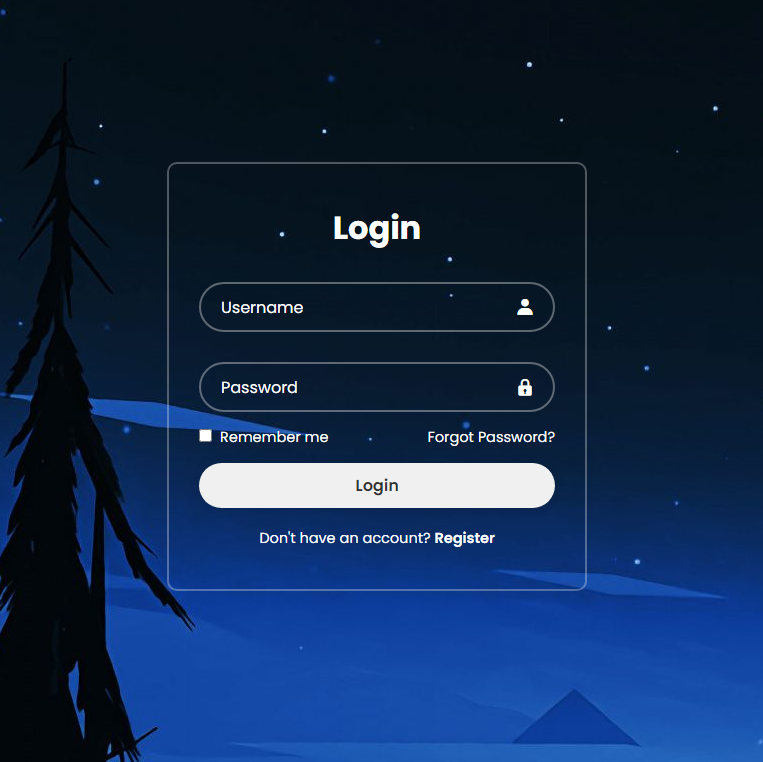

# PP - 001 Login Form

This is my personal project based on a Login Form

## Table of contents

- [Overview](#overview)
- [Screenshot](#screenshot)
- [Links](#links)
- [Built with](#built-with)
- [Author](#author)

## Overview

### Screenshot

### Links

- Solution URL: N/A

### Built with

- Semantic HTML5 markup
- CSS custom properties

## Author

- Frontend Mentor - [@RajanCP](https://www.frontendmentor.io/profile/RajanCP)
- GitHub - [@RajanCP] (https://github.com/RajanCP)

